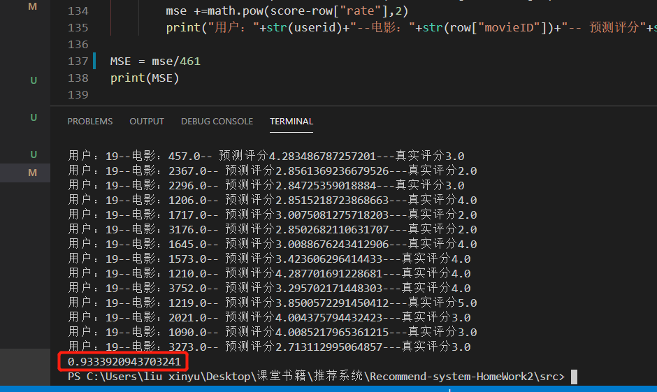

# Recommend-system-HomeWork
推荐系统作业 
<h3>一、&nbsp;什么是推荐系统？</h3>

&nbsp; &nbsp; &nbsp; &nbsp; 引用百度百科的一段解释就是：“利用电子商务网站向客户提供商品信息和建议，帮助用户决定应该购买什么产品，模拟销售人员帮助客户完成购买过程。个性化推荐是根据用户的兴趣特点和购买行为，向用户推荐用户感兴趣的信息和商品。”

&nbsp; &nbsp; &nbsp; &nbsp;在这个数据过载的时代，信息的消费者需要从海量的信息中找到自己所需要的信息，信息的生产者要让自己生产的信息在海量的信息中脱颖而出，这时推荐系统就应运而生了。对用户而言，推荐系统不需要用户提供明确的目标；对物品而言，推荐系统解决了2/8现象的问题（也叫长尾效应），让小众的物品可以展示到需要它们的用户面前。

<h3>2、基于用户的协同过滤推荐算法</h3>

当目标用户需要推荐时，可以先通过兴趣、爱好或行为习惯找到与他相似的其他用户，然后把那些与目标用户相似的用户喜欢的并且目标用户没有浏览过的物品推荐给目标用户。

1、基于用户的CF原理如下：

&nbsp; &nbsp; &nbsp; &nbsp; &nbsp; ① 分析各个用户对物品的评价，通过浏览记录、购买记录等得到用户的隐性评分；

&nbsp; &nbsp; &nbsp; &nbsp; &nbsp; ② 根据用户对物品的隐性评分计算得到所有用户之间的相似度；

&nbsp; &nbsp; &nbsp; &nbsp; &nbsp; ③ 选出与目标用户最相似的K个用户；

&nbsp; &nbsp; &nbsp; &nbsp; &nbsp; ④ 将这K个用户隐性评分最高并且目标用户又没有浏览过的物品推荐给目标用户。

<h3>3、基于物品的协同过滤推荐算法</h3>

当一个用户需要个性化推荐时，举个例子由于我之前购买过许嵩的《梦游计》这张专辑，所以会给我推荐《青年晚报》，因为很多其他用户都同时购买了许嵩的这两张专辑。

1、基于物品的CF原理如下：

&nbsp; &nbsp; &nbsp; &nbsp; &nbsp; &nbsp;① 分析各个用户对物品的浏览记录；

&nbsp; &nbsp; &nbsp; &nbsp; &nbsp; &nbsp;② 依据浏览记录分析得出所有物品之间的相似度；

&nbsp; &nbsp; &nbsp; &nbsp; &nbsp; &nbsp;③ 对于目标用户评价高的物品，找出与之相似度最高的K个物品；

&nbsp; &nbsp; &nbsp; &nbsp; &nbsp; &nbsp;④ 将这K个物品中目标用户没有浏览过的物品推荐给目标用户

<h3>3、基于矩阵分解的推荐算法</h3>
(1)MF把用户对item的评分矩阵分解为User矩阵和Item矩阵，其中User矩阵每一行代表一个用户的向量，Item矩阵的每一列代表一个item的向量；

(2)用户<em>i&nbsp;</em>对item<em> j&nbsp;</em>的预测评分等于User矩阵的第<em>i&nbsp;</em>行和Item矩阵的第<em>j&nbsp;</em>列的内积，预测评分越大表示用户<em>i&nbsp;</em>喜欢item<em> j&nbsp;</em>的可能性越大；

(3)MF是把User矩阵和Item矩阵设为未知量，用它们来表示每个用户对每个item的预测评分，然后通过最小化预测评分和实际评分的差异学习出User矩阵和Item矩阵；

(4)MF是一种隐变量模型，它通过在隐类别的维度上去匹配用户和item来做推荐。

(5)MF是一种降维方法，它将用户或item的维度降低到隐类别个数的维度。

SplitFile.py 划分测试集与训练集 
userCF.py 相邻用户推荐算法 
itemCF.py 相邻物品推荐算法 
MatrixDecomposition.py 矩阵分解 

原始数据集：movies.dat ratings.dat users.dat 
分割的训练与测试集：train.csv test.csv 
<h3>userCF 输出结果</h3>
MSE(均方误差)：0.9333920943703241

</img>

